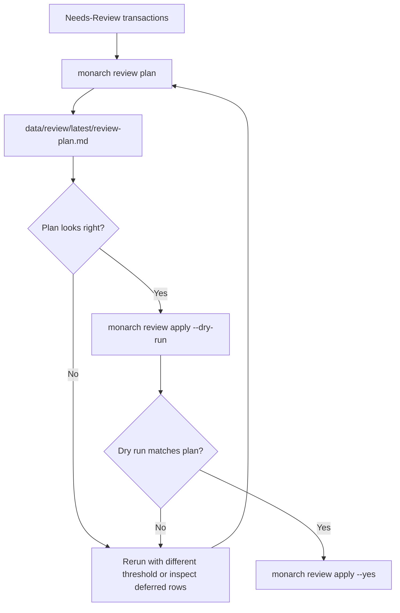
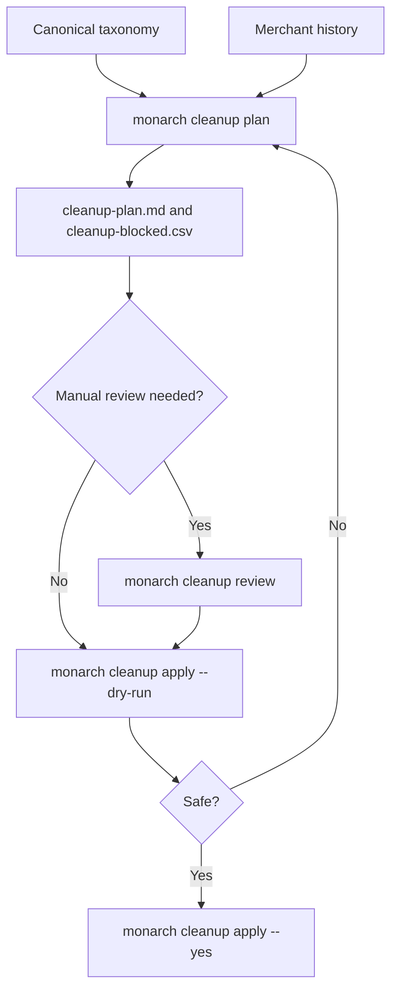
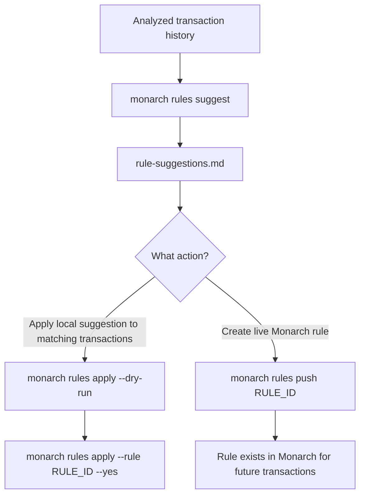
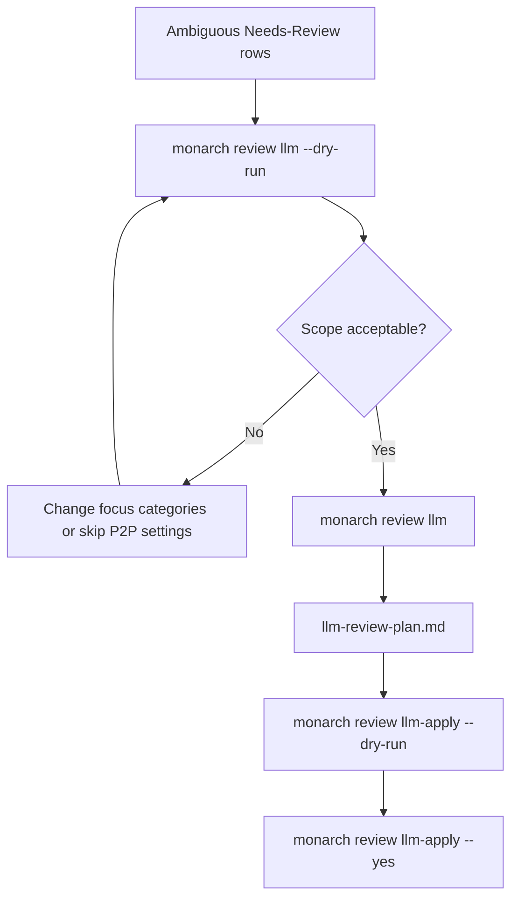

# Categorization Cleanup

Categorization work usually moves through three layers: review existing Needs-Review
transactions, clean up historical taxonomy drift, then create rules for repeated patterns.

## Needs-Review Flow



The plan uses reviewed merchant history to propose category changes and review clears. Pending
transactions are skipped unless you opt in.

```bash
monarch review plan
open reports/latest/review-plan.md
monarch review apply --dry-run
monarch review apply --yes
```

## Trusted Clear-Review Flow

Use this when categories are already trusted and the only action is clearing the Needs-Review
flag.

```bash
monarch review clear-plan
open reports/latest/clear-review-plan.md
monarch review clear-apply --dry-run
monarch review clear-apply --yes
```

## Taxonomy Cleanup Flow



`cleanup plan` combines deterministic taxonomy migrations with merchant-history consistency
candidates. Blocked rows usually mean the category does not exist in Monarch yet.

## Rule Creation Flow



`rules apply` updates transactions that match enabled local suggestions. `rules push` creates a
live Monarch rule but does not apply it to existing transactions unless Monarch changes that API
behavior.

## LLM Review Flow



LLM review can send merchant names, account names, date ranges, amount ranges, and category
names to the selected LLM backend. See [Privacy & Security](privacy-security.md) before using it.
