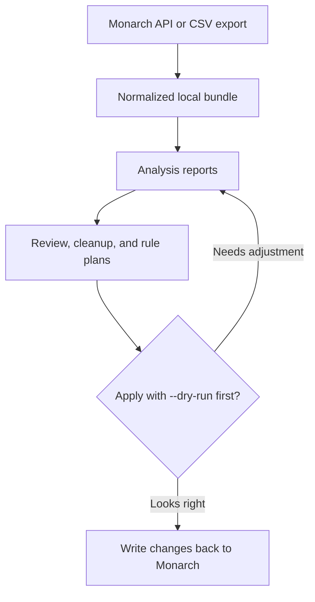

# monarch-money-tools

A CLI for Monarch Money users who want programmatic control over transaction categorization,
cleanup, and rule management — beyond what the Monarch UI provides.

[](https://github.com/nbellowe/monarch-money-tools/blob/main/LICENSE)
[](https://python.org)

> **Unofficial API notice:** This tool uses Monarch Money's unofficial GraphQL API.
> It may break without notice. Not affiliated with Monarch Money.

---

## Quick Start

API-backed workflow:

```bash
monarch init
monarch pull
monarch data analyze
monarch data report
open reports/latest/summary.md
```

CSV-only workflow:

```bash
monarch run ~/Downloads/monarch_transactions.csv
open reports/latest/summary.md
```

Categorization cleanup:

```bash
monarch review plan
open reports/latest/review-plan.md
monarch review apply --dry-run
monarch review apply --yes
```

---

## What It Does

monarch-money-tools complements the Monarch Money UI for tasks that need bulk operations or
programmatic control:

- **Categorization:** Bulk-update miscategorized transactions, run LLM-assisted review passes
- **Rules:** Generate and apply automation rules from transaction history
- **Cleanup:** Migrate legacy categories, fix merchant-name inconsistencies
- **Cashflow:** Separate salary, reimbursements, transfers, investments, and spending
- **Retirement Simulator:** Generate a personalized Monte Carlo retirement simulation HTML from a `profile.yaml` config

## How The Pieces Fit



Start with [Install](install.md), then follow the [Workflows](workflows.md) guide for the
use case you care about.
