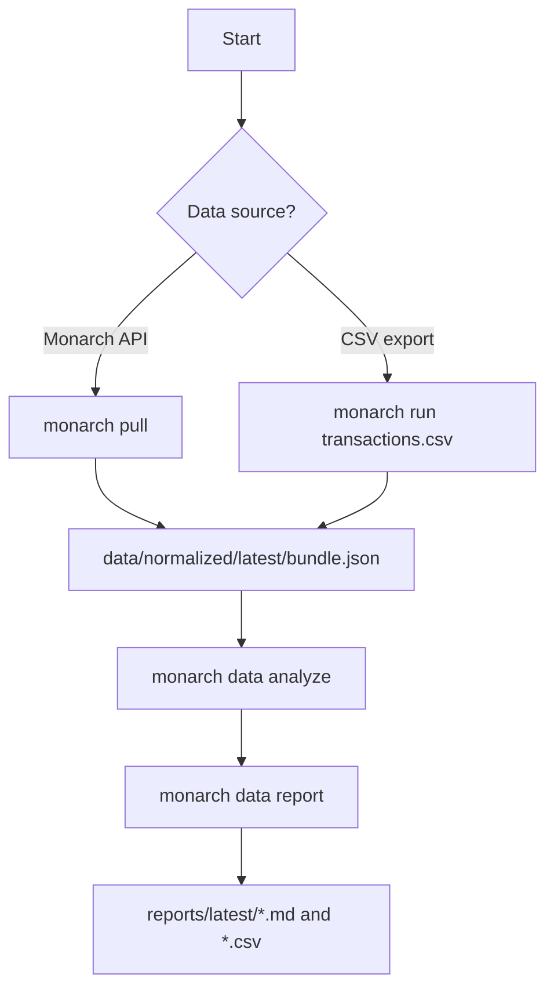
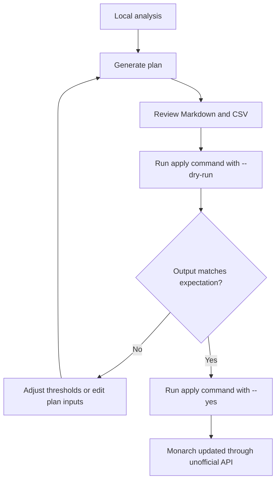

# Workflows

monarch-money-tools is built around local artifacts. Pull or import data first, generate a
reviewable plan, inspect the Markdown/CSV output, then apply changes only after a dry run.

## Data Intake



Use the API path when you want write-back workflows. Use the CSV path when you only want local
analysis or do not want to configure credentials.

## API Path

```bash
monarch init
monarch pull
monarch data analyze
monarch data report
open reports/latest/summary.md
```

## CSV Path

```bash
monarch run ~/Downloads/monarch_transactions.csv
open reports/latest/summary.md
```

After a successful pull or import, `monarch run` with no CSV reuses
`data/normalized/latest/bundle.json`.

## Safe Mutation Pattern



Every write-back workflow should follow this pattern. The generated `data/` and `reports/`
artifacts are local and gitignored.

You can also set `MONARCH_DRY_RUN=1` while reviewing plans. Commands that write back to
Monarch will preview the proposed change instead of calling the API.

## Useful Command Groups

| Group | Purpose |
| --- | --- |
| `monarch data` | Pull/import data, analyze it, and render reports |
| `monarch review` | Plan and apply Needs-Review category changes |
| `monarch cleanup` | Apply taxonomy migrations and merchant consistency cleanup |
| `monarch rules` | Suggest local rules and push selected rules to Monarch |
